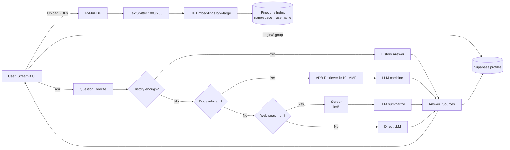

# QuickBrain

Streamlit RAG chat app with Pinecone, SambaNova LLM, and Supabase-backed auth.

## Summary

- Upload PDF, DOCX, TXT files. Text is extracted, chunked, embedded with `BAAI/bge-large-en-v1.5`, and indexed in **Pinecone**.
- Ask questions in chat. The app answers from chat memory first, then RAG over Pinecone, then optional web search, else direct LLM.
- Users sign up and log in. Passwords are hashed and profiles plus chats are stored in **Supabase**.
- Sidebar controls: API keys, web-search toggle, document processing, chat search, and new chat.

## Architecture



## Key Components

- **Streamlit UI**: chat interface, sidebar settings, chat list and search.
- **Auth + Persistence**: Supabase table `profiles` keeps `username`, `password` (SHA‑256 hash), and a list of `chats`. Chats store `id`, `title`, `messages`, `created_at`, `updated_at`.
- **PDF ingestion**: `PyMuPDF` for text, `RecursiveCharacterTextSplitter` with `chunk_size=1000`, `chunk_overlap=200`.
- **Embeddings**: `HuggingFaceEmbeddings("BAAI/bge-large-en-v1.5")`.
- **Vector store**: **Pinecone** via `PINECONE_HOST` and `PINECONE_API_KEY`. Namespace per user = `username`. IDs are SHA‑1 of content + source.
- **LLM**: `SambaNovaCloud(model="Meta-Llama-3.3-70B-Instruct")`.
- **Answering flow**:
  1) Probe chat history. If enough, answer.  
  2) Else RAG over Pinecone (k=10, MMR).  
  3) If still insufficient and web search toggled with key present, call Serper and summarize with sources.  
  4) Else answer directly with the LLM.

## Requirements

- Python 3.10+
- Accounts/keys:
  - **Supabase**: `SUPABASE_URL`, `SUPABASE_KEY`
  - **Pinecone**: `PINECONE_API_KEY`, **`PINECONE_HOST`** (use host, not index name)
  - **SambaNova** API key (entered in sidebar)
  - **Serper** API key for optional web search (entered in sidebar)

## Installation

```bash
pip install -U streamlit pymupdf langchain langchain-community langchain-huggingface langchain-pinecone supabase python-dotenv
```

> If you use GPU embeddings or other models, install the matching extras separately.

## Configuration

Create a `.env` that the app loads. By default the code calls:
```python
load_dotenv(dotenv_path=".env")
```
Options:
- Put your variables in `.env`, or
- Change the `dotenv_path` in `quickbrain.py` to your desired location.

Minimum variables in .env file:
```
SUPABASE_URL=...
SUPABASE_KEY=...
PINECONE_API_KEY=...
PINECONE_HOST=...
```

## Running

```bash
streamlit run quickbrain.py
```

In the sidebar:
1. Paste SambaNova API key. Optionally paste Serper API key.
2. Toggle **Web search** if you want web fallback.
3. Upload PDFs and click **Process Documents**.
4. Start chatting. Use **Chats** to create or open a conversation. Use **Search chats** to filter by message text.

## Notes and Defaults

- Chunking: 1000 tokens, 200 overlap.
- Retrieval: MMR with `k=10`.
- Pinecone namespace: the current `username`.
- Password hashing: SHA‑256 for demo. For production, prefer a dedicated auth provider or salted password hashing (e.g., Argon2/bcrypt) with rate‑limiting and MFA.
- If Serper key is missing or web search is off, the app falls back to RAG or direct LLM.

## Troubleshooting

- **Pinecone connection**: pass **`PINECONE_HOST`**. Do not pass an index name here. If you only have the index name, open the Pinecone console and copy the host for that index.
- **“Supabase credentials not found”**: set `SUPABASE_URL` and `SUPABASE_KEY` in the `.env` that `quickbrain.py` loads.
- **No answer from docs**: confirm documents were processed, embeddings created, and the correct namespace is used.
- **Serper missing**: web search button can be ON, but without a Serper key the code will skip web and use LLM only.

## License

MIT. See `LICENSE`.