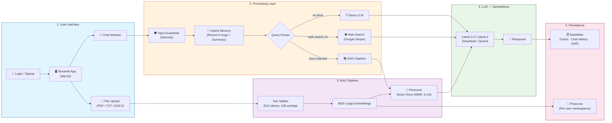

# QuickBrain

An AI-powered document Q&A chatbot with RAG (Retrieval-Augmented Generation), web search, and persistent chat history.

## Architecture


```mermaid
graph LR
    %% Input
    subgraph Input [1. User Interface]
        Login["🔐 Login / Signup"] --> UI["🖥️ Streamlit App<br>(app.py)"]
        UI --> Upload["📄 File Upload<br>(PDF / TXT / DOCX)"]
        UI --> Chat["💬 Chat Window"]
    end

    %% Processing
    subgraph Processing [2. Processing Layer]
        Chat --> Guard["🛡️ Input Guardrails<br>(Detoxify)"]
        Guard --> Memory["🧠 Hybrid Memory<br>(Recent 6 msgs + Summary)"]
        Memory --> Router{"Query Router"}
        Router -->|docs indexed| RAG["📚 RAG Pipeline"]
        Router -->|web search on| Web["🌐 Web Search<br>(Google Serper)"]
        Router -->|no docs| Direct["💡 Direct LLM"]
    end

    %% RAG
    subgraph RAG_Pipeline [3. RAG Pipeline]
        Upload --> Chunk["Text Splitter<br>(512 tokens, 128 overlap)"]
        Chunk --> Embed["BGE-Large Embeddings"]
        Embed --> Pine["📌 Pinecone<br>Vector Store (MMR, k=10)"]
        RAG --> Pine
    end

    %% LLM
    subgraph LLM_Layer [4. LLM — SambaNova]
        Pine & Web & Direct --> LLM["Llama 3.3 / Llama 4<br>DeepSeek / Qwen3"]
        LLM --> Answer["📝 Response"]
    end

    %% Persistence
    subgraph Persistence [5. Persistence]
        Answer --> Supa["🗄️ Supabase<br>(Users · Chat History · Auth)"]
        Embed --> PineNS["📌 Pinecone<br>(Per-user namespaces)"]
    end

    style Input fill:#e1f5fe,stroke:#01579b
    style Processing fill:#fff3e0,stroke:#e65100
    style RAG_Pipeline fill:#f3e5f5,stroke:#6a1b9a
    style LLM_Layer fill:#e8f5e9,stroke:#1b5e20
    style Persistence fill:#fce4ec,stroke:#880e4f
```

## Features

- **Multi-format Document Ingestion**: PDF (with table extraction), TXT, DOCX
- **Hybrid RAG**: Vector search via Pinecone with MMR for diversity
- **Web Search**: Optional Google Serper integration for real-time information
- **Hybrid Memory**: Keeps recent messages verbatim, summarizes older context
- **Content Moderation**: Detoxify-based input guardrails
- **Multi-model Support**: 12+ LLMs via SambaNova Cloud
- **Persistent Chats**: Supabase-backed conversation history

## Quick Start

### 1. Clone & Install

```bash
git clone <repository-url>
cd quickbrain
pip install -r requirements.txt
```

### 2. Configure Environment

Create a `.env` file:

```env
SUPABASE_URL=your_supabase_url
SUPABASE_KEY=your_supabase_anon_key
PINECONE_API_KEY=your_pinecone_key
PINECONE_INDEX_NAME=your_index_name
```

### 3. Run

```bash
streamlit run app.py
```

## Project Structure

```
├── app.py                    # Main Streamlit application
├── config.py                 # Environment variables and constants
├── services/
│   ├── ai_processor.py       # LLM, embeddings, RAG, guardrails
│   ├── authentication.py     # Supabase auth (signup/login)
│   ├── chat_manager.py       # Session state, hybrid memory
│   └── pdf_processor.py      # PDF extraction with table handling
├── ui/
│   └── components.py         # Sidebar, chat list, settings UI
├── utils/
│   └── common_utils.py       # Hashing, file utils, rate limiting
└── artifacts/                # (if applicable) stored models
```

## Configuration

| Variable | Description |
|----------|-------------|
| `MAX_FILES` | Max uploadable files per session (default: 3) |
| `MAX_FILE_SIZE_BYTES` | File size limit (default: 2MB) |
| `DEFAULT_MODEL` | Fallback LLM model |
| `TIMEZONE` | Timestamp timezone (default: Asia/Kolkata) |

## API Keys Required

| Service | Purpose | Get it from |
|---------|---------|-------------|
| SambaNova | LLM inference | [SambaNova Cloud](https://cloud.sambanova.ai) |
| Pinecone | Vector storage | [Pinecone](https://pinecone.io) |
| Supabase | Auth + chat persistence | [Supabase](https://supabase.com) |
| Serper (optional) | Web search | [Serper](https://serper.dev) |

## How It Works

1. **Upload Documents** → PDF/TXT/DOCX files are chunked (512 tokens, 128 overlap)
2. **Embed & Index** → BGE-large embeddings stored in Pinecone under user namespace
3. **Query** → User question checked for toxicity, then routed:
   - If documents indexed → RAG retrieval (MMR, k=10)
   - If web search enabled → Serper API fetch
   - Else → Direct LLM response with conversation context
4. **Memory** → Recent 6 messages kept verbatim; older messages summarized after 15 total

## Evaluation Results

To rigorously validate QuickBrain's reliability, we ran an automated evaluation using **Qwen2.5-7B-Instruct** as the judge model via **LlamaIndex**, across a curated **330-question dataset** spanning both document-grounded and open-web queries. The evaluation measured two core dimensions: answer accuracy and hallucination rate.


---

### 📊 Overall Accuracy — **88.2%** *(291 / 330 correct)*

Across all 330 test questions, QuickBrain answered **291 correctly** — an overall accuracy of **88.2%**. This figure covers the full breadth of the system's capabilities, from document retrieval to live web search, and reflects a production-ready quality bar for an AI Q&A assistant.

---

### 📚 Document (RAG) Accuracy — **81.2%** *(138 / 170 correct)*

For the 170 questions that required answering directly from uploaded documents, the RAG pipeline achieved **81.2% accuracy**. This is a meaningful result for a retrieval system operating on heterogeneous documents (PDFs, DOCX, TXT) with real-world noise — validating that the chunking strategy (512 tokens, 128 overlap), BGE-Large embeddings, and MMR-based Pinecone retrieval effectively surface the right context for the LLM to reason over.

---

### 🌐 Internet Search Accuracy — **95.6%** *(153 / 160 correct)*

For the 160 questions routed to live web search via Google Serper, QuickBrain achieved a standout accuracy of **95.6%** — the highest of any subsystem. This highlights that when the query router correctly identifies real-time or general-knowledge questions and delegates to web search, the pipeline is close to flawless. The gap between RAG and web search accuracy also reflects the inherent challenge of grounding answers in user-uploaded, potentially incomplete documents versus the breadth of indexed web content.

---

### 🧠 Hallucination Analysis — **81.2% Reduction**

| Condition | Hallucination Rate |
|---|---|
| Baseline (bare LLM, no RAG) | **100%** |
| With RAG enabled | **18.8%** |
| **Reduction** | **↓ 81.2%** |

Perhaps the most compelling finding: without RAG, a standalone LLM hallucinated on **every single question** in the document-grounded test set — a 100% hallucination rate, which is expected when the model has no access to the actual document content. Once the RAG pipeline was activated, hallucinations dropped to just **18.8%**, representing an **81.2 percentage point reduction**. This confirms that the retrieval-augmentation layer is not a cosmetic addition — it is the critical mechanism that anchors the model's responses in ground truth and makes the system trustworthy for document Q&A use cases.

## License

MIT